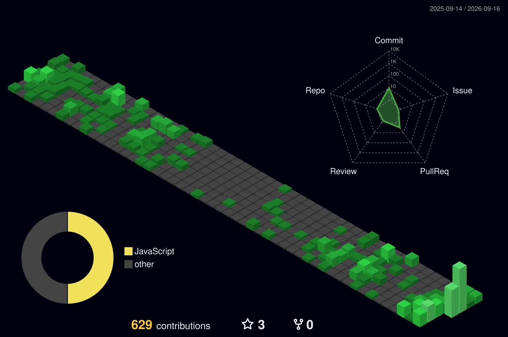

<div align="center">


</div>

---

```console
zhengjieyu@pqc:~$ whoami
Jieyu Zheng — post-quantum cryptography engineer

zhengjieyu@pqc:~$ ls skills/
```

<div align="center">


</div>

```console
zhengjieyu@pqc:~$ cat links.sh
```

<div align="center">

[](https://scholar.google.com/citations?user=1wNJ7usAAAAJ&hl=zh-CN)
[](https://zhengjieyu.github.io/)
[](https://github.com/zhengjieyu)
[](mailto:zzhengjieyu@gmail.com)

</div>

---

<div align="center">


<br/>


</div>

```console
zhengjieyu@pqc:~$ contrib --3d   # isometric commit calendar
```

<div align="center">
  
</div>

<br/>

<div align="center">
  
</div>
